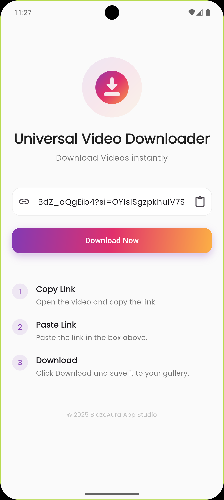

# Universal Video Downloader 📥


A clean, fast, and powerful Flutter application to download videos instantly from various social media platforms and websites. Designed with a simple 3-step user experience: **Copy, Paste, Download**.

## 🚀 Features

* **Universal Support:** Download videos from major social platforms (Instagram, Facebook, TikTok, Twitter/X, etc.) and generic URLs.
* **One-Click Download:** Instant processing with a "Download Now" button.
* **Smart Clipboard Detection:** Automatically detects copied links (optional feature).
* **Clean UI/UX:** Modern, minimalist design with a focus on usability.
* **Gallery Integration:** Saves downloaded videos directly to the device's gallery.
* **Progress Tracking:** Real-time download progress indicators.
* **Offline Access:** Watch your favorite videos anytime, anywhere.

## 📱 How It Works

As seen in the app interface, downloading is as easy as 1-2-3:

1.  **Copy Link:** Open the video on your social media app or browser and copy the link.
2.  **Paste Link:** Open the app and paste the link in the input box.
3.  **Download:** Click "Download Now" and save it to your gallery.


## ⚙️ Installation & Setup

Follow these steps to run the project locally:

1.  **Clone the repository**
    ```bash
    git clone [https://github.com/NishadMiah/universal_video-downloader.git](https://github.com/NishadMiah/universal_video-downloader.git)
    cd universal-video-downloader
    ```

2.  **Install dependencies**
    ```bash
    flutter pub get
    ```

3.  **Run the app**
    ```bash
    flutter run
    ```

## 🔐 Permissions Configuration

### Android (`android/app/src/main/AndroidManifest.xml`)
Ensure you have the following permissions to save files:
```xml
<uses-permission android:name="android.permission.INTERNET"/>
<uses-permission android:name="android.permission.WRITE_EXTERNAL_STORAGE"/>
<uses-permission android:name="android.permission.READ_EXTERNAL_STORAGE"/>
